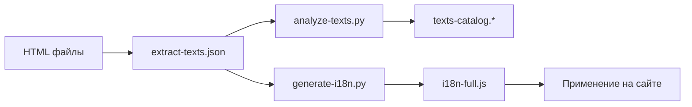

# 📊 Полный анализ текстов проекта Healthcare Web

## 🎯 Обзор

Проведен полный анализ всех HTML файлов проекта с извлечением и категоризацией всех текстовых элементов.

**Дата анализа**: 2025-12-22
**Проанализировано файлов**: 73 HTML файла
**Извлечено уникальных корейских текстов**: 216

---

## 📁 Созданные файлы

### 1. Основные данные

| Файл | Размер | Описание |
|------|--------|----------|
| `extracted-texts.json` | 991 KB | Полный дамп всех извлеченных текстов из HTML |
| `texts-catalog.json` | 73 KB | Структурированный каталог с категоризацией |
| `texts-catalog.csv` | 27 KB | Каталог в формате CSV для Excel |
| `texts-catalog.md` | 47 KB | Детальный отчет в формате Markdown |

### 2. Система интернационализации (i18n)

| Файл | Размер | Описание |
|------|--------|----------|
| `i18n.js` | 41 KB | Основной файл переводов (ручная версия) |
| `i18n-full.js` | 53 KB | Автоматически сгенерированный полный файл |
| `i18n-replacer.js` | 10 KB | Скрипт для замены текстов в HTML |
| `I18N_README.md` | 8.6 KB | Инструкция по использованию i18n |

### 3. Инструменты

| Файл | Размер | Описание |
|------|--------|----------|
| `generate-i18n.py` | 8.8 KB | Python скрипт для генерации i18n.js |
| `analyze-texts.py` | 8.6 KB | Python скрипт для анализа и категоризации |

---

## 📈 Статистика извлеченных текстов

### Корейские тексты (216 уникальных)

#### По категориям контента:

- **PROJECTS** (Проекты): 76 текстов
- **NEWS** (Новости): 41 текст
- **RESEARCH** (Исследования): 38 текстов
- **FOOTER** (Подвал): 16 текстов
- **HISTORY** (История): 11 текстов
- **OVERVIEW** (О компании): 9 текстов
- **CONTACT** (Контакты): 9 текстов
- **FAQ**: 5 текстов
- **LOCATION** (Местоположение): 5 текстов
- **BUTTONS** (Кнопки): 3 текста
- **GALLERY** (Галерея): 2 текста
- **FORMS** (Формы): 1 текст

#### По типу HTML элементов:

- **Заголовки** (h1-h6): 59 текстов - 132 вхождения
- **Параграфы** (p): 37 текстов - 597 вхождений
- **Другие элементы**: 34 текста - 76 вхождений
- **Метки** (span, label): 29 текстов - 185 вхождений
- **Списки** (li): 19 текстов - 38 вхождений
- **Ссылки** (a): 18 текстов - 94 вхождения
- **Заголовки страниц** (title): 13 текстов - 33 вхождения
- **Таблицы** (td, th): 3 текста - 18 вхождений
- **Мета-атрибуты**: 3 текста - 30 вхождений
- **Кнопки** (button): 1 текст - 6 вхождений

### Английские тексты (396 уникальных)

- **Другие элементы**: 163 текста
- **Заголовки**: 58 текстов
- **Метки**: 43 текста
- **Мета-атрибуты**: 39 текстов
- **Параграфы**: 36 текстов
- **Ссылки**: 34 текста
- **Заголовки страниц**: 18 текстов
- **Таблицы**: 5 текстов

### Смешанные тексты (74 уникальных)

Тексты, содержащие смесь корейского, английского и других языков.

---

## 🔍 Примеры извлеченных текстов

### Наиболее часто встречающиеся (Footer)

Эти тексты встречаются в **64 файлах** (практически на всех страницах):

- 상호 (Название компании)
- 대표명 (Представитель)
- 디펄스 (DePulse)
- 주소 (Адрес)
- 서울특별시 중구 세종대로 110 (Адрес в Сеуле)
- 전화번호 (Телефон)
- 사업자등록번호 (Рег. номер)
- 팩스 (Факс)

### Заголовки страниц (titles)

- "2024년 신제품 출시 안내" (Уведомление о выпуске нового продукта 2024)
- "건강과 과학의 조화를 통해 만들어온 혁신의 여정" (Путь инноваций через гармонию здоровья и науки)
- "본사 이전 안내" (Уведомление о переезде офиса)
- "추석 연휴 기간 배송 일정 안내" (График доставки на праздник Чусок)

### Основной контент (Overview)

- "우리는 의료와 기술의 경계를 허물고, 건강 혁신의 새로운 패러다임을 창조합니다."
  - "Мы разрушаем границы между медициной и технологиями, создавая новую парадигму инноваций в здравоохранении."

- "건강한 삶을 위한 과학, 우리 모두를 위한 미래"
  - "Наука для здоровой жизни, будущее для всех нас"

### Проекты и кейсы

- "의료기관" (Медицинское учреждение)
- "연구소" (Исследовательский институт)
- "개인 건강 관리" (Управление личным здоровьем)
- "만성질환 예방 및 AI 기반 건강 솔루션" (Профилактика хронических заболеваний и решения на основе ИИ)

---

## 🛠️ Как использовать созданные файлы

### 1. Просмотр каталога текстов

#### В формате Markdown (удобно для чтения):
```bash
# Открыть в любом Markdown редакторе
open texts-catalog.md
```

#### В формате CSV (для Excel/Google Sheets):
```bash
# Открыть в Excel, Numbers или Google Sheets
open texts-catalog.csv
```

#### В формате JSON (для программной обработки):
```json
{
  "footer": [
    {
      "text": "상호",
      "type": "paragraphs",
      "context": "p",
      "count": 64,
      "files": [...]
    }
  ]
}
```

### 2. Использование системы i18n

#### Базовое подключение:
```html
<head>
  <script src="wp-content/i18n-full.js"></script>
  <script src="wp-content/i18n-replacer.js"></script>
</head>
```

#### Использование в JavaScript:
```javascript
// Получить перевод
const text = i18nFull.t('footer.text1');

// Переключить язык
i18nFull.setLanguage('en'); // английский
i18nFull.setLanguage('ru'); // русский
i18nFull.setLanguage('ko'); // корейский

// Получить статистику
const stats = i18nFull.getStats();
console.log(stats);
```

### 3. Генерация обновленного i18n файла

```bash
# Перейти в директорию
cd wp-content

# Запустить генератор
python3 generate-i18n.py

# Будет создан/обновлен файл i18n-full.js
```

### 4. Повторный анализ текстов

```bash
# Запустить анализатор
python3 analyze-texts.py

# Будут созданы/обновлены:
# - texts-catalog.md
# - texts-catalog.csv
# - texts-catalog.json
```

---

## 📋 Структура extracted-texts.json

```json
{
  "korean": {
    "titles": [
      {
        "text": "текст заголовка",
        "context": "title",
        "files": ["путь/к/файлу1.html", "путь/к/файлу2.html"]
      }
    ],
    "headings": [...],
    "paragraphs": [...],
    "links": [...],
    "buttons": [...],
    "lists": [...],
    "tables": [...],
    "labels": [...],
    "meta": [...],
    "other": [...]
  },
  "english": { /* аналогичная структура */ },
  "mixed": { /* аналогичная структура */ },
  "other": { /* прочие языки */ }
}
```

Каждый элемент содержит:
- `text`: сам текст
- `context`: тип HTML элемента или атрибута
- `files`: массив путей к файлам, где текст встречается

---

## 🎨 Категоризация текстов

Тексты автоматически категоризируются на основе:

1. **Ключевых слов** в тексте
2. **Пути к файлу** (например, history/index.html → category: history)
3. **Частоты появления** (тексты в 50+ файлах → footer)
4. **Контекста HTML** (button → buttons, h1-h6 → headings)

### Категории:

- `navigation` - Навигация, меню
- `footer` - Подвал сайта (контактная информация)
- `history` - История компании
- `overview` - О компании, обзор
- `projects` - Проекты, портфолио, кейсы
- `faq` - Часто задаваемые вопросы
- `location` - Местоположение, адреса
- `research` - Исследования и разработка
- `news` - Новости, анонсы
- `gallery` - Галерея
- `contact` - Контакты, форма обратной связи
- `buttons` - Кнопки
- `forms` - Формы ввода

---

## 🌐 Поддерживаемые языки

### Текущие:
- 🇰🇷 **Корейский** (기본) - 216 текстов
- 🇬🇧 **Английский** - автоматическая заглушка `[EN] текст`
- 🇷🇺 **Русский** - автоматическая заглушка `[RU] текст`

### Добавление переводов:

1. Откройте `i18n-full.js`
2. Замените заглушки `[EN]` и `[RU]` на реальные переводы
3. Или используйте API переводов для автоматического перевода

---

## 📊 Рекомендации по работе с текстами

### Для переводчиков:

1. **Используйте CSV файл** для работы в Excel/Google Sheets
2. Отсортируйте по категориям для удобства
3. Обратите внимание на столбец "Count" - наиболее важные тексты встречаются чаще

### Для разработчиков:

1. **Используйте JSON файлы** для программной обработки
2. `texts-catalog.json` - для работы с категоризированными текстами
3. `extracted-texts.json` - для доступа к исходным данным с путями файлов

### Для контент-менеджеров:

1. **Используйте Markdown файл** для просмотра и планирования
2. Категории помогут структурировать работу по секциям сайта
3. Примеры файлов показывают, где используется каждый текст

---

## 🔄 Рабочий процесс обновления переводов



1. **Извлечение** - агент извлекает тексты из HTML → `extracted-texts.json`
2. **Анализ** - `analyze-texts.py` создает каталоги
3. **Генерация** - `generate-i18n.py` создает i18n файл
4. **Перевод** - редактирование переводов в `i18n-full.js`
5. **Применение** - подключение на сайте

---

## 💡 Полезные команды

```bash
# Поиск конкретного текста
grep -n "건강한 삶" texts-catalog.md

# Подсчет текстов по категории
grep "^## " texts-catalog.md

# Экспорт только корейских текстов
jq '.korean' extracted-texts.json > korean-only.json

# Статистика по типам элементов
jq '.korean | keys' extracted-texts.json
```

---

## 📝 Заметки

### Особенности корейского текста:

1. **Footer тексты** встречаются в 64 из 73 файлов (88%)
2. **Навигация** использует смесь корейского и английского
3. **Длинные тексты** в секциях Overview и Projects
4. **Структурированные данные** в таблицах (Projects)

### Для улучшения переводов:

- Обратите внимание на контекст использования
- Сохраняйте форматирование (strong, em)
- Учитывайте длину текста для UI элементов
- Проверяйте специальные символы и HTML entities

---

## ✅ Результат

Создана полная система для управления текстами проекта:

✓ Извлечены все тексты из 73 HTML файлов
✓ Категоризировано 216 уникальных корейских текстов
✓ Создана система i18n с поддержкой 3 языков
✓ Подготовлены файлы в форматах: JSON, CSV, Markdown
✓ Написаны скрипты для автоматизации процесса
✓ Подготовлена документация по использованию

**Все готово для перевода сайта на другие языки!** 🚀
